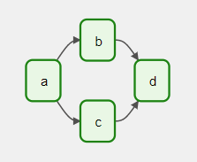
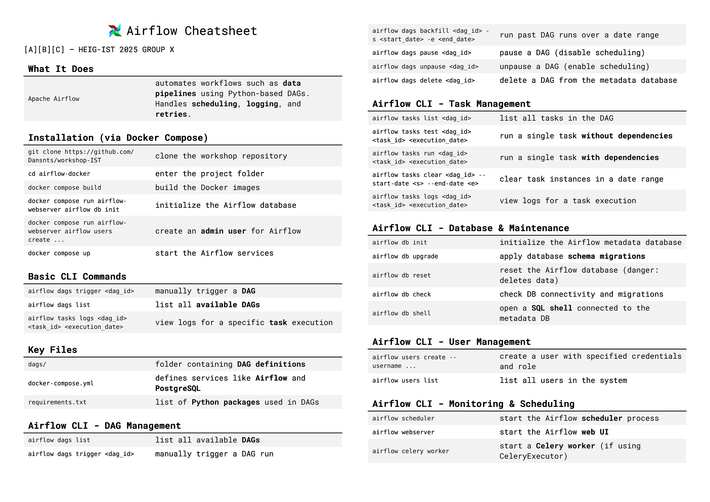
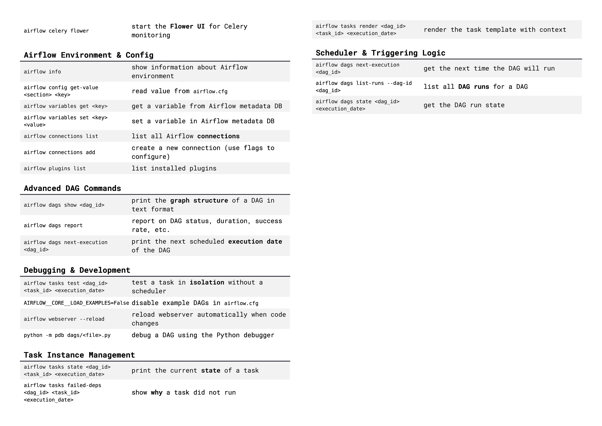

# Apache Airflow Project Overview — Group Presentation

## Table of Contents

- [Apache Airflow Project Overview — Group Presentation](#apache-airflow-project-overview--group-presentation)
  - [Table of Contents](#table-of-contents)
  - [Context](#context)
  - [Project Goal](#project-goal)
  - [Why Apache Airflow?](#why-apache-airflow)
  - [What is a DAG?](#what-is-a-dag)
  - [Why DAGs are Important in Airflow](#why-dags-are-important-in-airflow)
  - [How DAGs Work in Airflow](#how-dags-work-in-airflow)
  - [Example Use Case: Daily CSV Aggregation](#example-use-case-daily-csv-aggregation)
  - [Cost Considerations](#cost-considerations)
    - [Self-Hosted with Docker (LocalExecutor + PostgreSQL)](#self-hosted-with-docker-localexecutor--postgresql)
    - [Managed Airflow (like AWS MWAA, Astronomer)](#managed-airflow-like-aws-mwaa-astronomer)
    - [Our recommendation:](#our-recommendation)
  - [Strategic Considerations](#strategic-considerations)
    - [Pros:](#pros)
    - [Cons:](#cons)
    - [Vendor Lock-In Risk:](#vendor-lock-in-risk)
  - [When to Use Airflow](#when-to-use-airflow)
  - [Getting Started with Airflow (Cheat Sheet)](#getting-started-with-airflow-cheat-sheet)
    - [Key Files:](#key-files)
  - [Further Resources](#further-resources)
  - [Prerequisites](#prerequisites)
  - [Getting Started](#getting-started)
    - [1. Clone the repository](#1-clone-the-repository)
    - [2. Build the Docker images](#2-build-the-docker-images)
    - [3. Initialize the Airflow database](#3-initialize-the-airflow-database)
    - [4. Create an Airflow admin user (optional but recommended)](#4-create-an-airflow-admin-user-optional-but-recommended)
    - [5. Start Airflow services](#5-start-airflow-services)
  - [Directory Structure](#directory-structure)
  - [Example DAG](#example-dag)
  - [Useful Commands](#useful-commands)
    - [Re-initialize the database (This will erase metadata!)](#re-initialize-the-database-this-will-erase-metadata)
    - [Install additional Python packages](#install-additional-python-packages)
  - [Stopping Services](#stopping-services)
  - [Notes](#notes)
  - [Contact](#contact)

---

## Context

Our team of data engineers and data scientists is working within a Swiss small-to-medium business (SMB) that heavily relies on data. Our manager is exploring the adoption of **open-source tools** and **cloud-based services** to improve our workflows in data engineering and data science.

We chose to investigate **Apache Airflow**, an open-source workflow orchestration tool that is widely used in the data engineering ecosystem.

---

## Project Goal

To demonstrate the value of Apache Airflow through:

* A **clear explanation** of what Airflow is, and why it matters.
* A **practical example use case** tailored for an SMB.
* A **live demo** of a running Airflow setup using Docker Compose.
* A discussion on **costs, strategic considerations**, and **vendor lock-in risks**.

---

## Why Apache Airflow?


Apache Airflow is a platform to programmatically author, schedule, and monitor workflows. It’s particularly powerful for ETL (Extract, Transform, Load) and data pipeline automation.

**Key benefits:**

* Open-source, active community
* Python-native workflow definitions
* Extensible through plugins and custom operators
* UI for visualizing DAGs (Directed Acyclic Graphs)

**Why it's relevant for SMBs:**

* Reduces manual workflow management
* Avoids expensive vendor-specific solutions
* Easy to run locally or in cloud environments

---

## What is a DAG?

DAG stands for **Directed Acyclic Graph**. In the context of Apache Airflow, a DAG is a collection of all the tasks you want to run, organized in a way that clearly defines their execution order and dependencies. Each node in the graph represents a task, and the edges (arrows) represent the dependencies between these tasks.

- **Directed:** The tasks flow in a specific direction, from upstream to downstream.
- **Acyclic:** There are no cycles or loops in the graph, meaning a task cannot depend on itself directly or indirectly.


Basicallly, a DAG in Apache Airflow is the backbone of our workflow orchestration. It ensures tasks run in a specific order without cycles, allows complex dependencies, and provides robust scheduling and monitoring capabilities.

## Why DAGs are Important in Airflow

Apache Airflow uses DAGs to orchestrate complex workflows. Here's why DAGs are crucial:

1. **Workflow Management:** DAGs let us define the sequence and dependencies of tasks in a clear and manageable way.
2. **Task Scheduling:** Airflow uses the DAG to schedule tasks and execute them in the correct order.
3. **Failure Handling:** The DAG structure helps Airflow know what to do if a task fails, such as retrying or skipping dependent tasks.
4. **Visualization:** Airflow's UI visually represents DAGs, making it easier to monitor and debug workflows.
5. **Scalability:** By defining dependencies explicitly, Airflow can run tasks in parallel where possible, optimizing resource use.

## How DAGs Work in Airflow

- We need to write a DAG in Python code, defining tasks and their dependencies.
- Airflow parses the DAG file and builds the DAG structure.
- Based on the schedule you define, Airflow triggers the DAG runs.
- Tasks execute respecting the defined order and dependencies.
- Airflow tracks the status of each task and the overall DAG run.


---
## Example Use Case: Daily CSV Aggregation

Imagine our company receives daily CSV sales data from multiple branches. The goal is to:

1. Automatically ingest these files
2. Validate and clean the data
3. Aggregate sales per product and region
4. Save the result into a PostgreSQL database

Airflow lets us build and schedule this pipeline with clear, maintainable logic, error handling, and monitoring.

---

## Cost Considerations

### Self-Hosted with Docker (LocalExecutor + PostgreSQL)

* **Infrastructure**: On-premise or cloud VM (e.g., 2 vCPU, 4GB RAM)
* **Monthly cost estimate**: \~CHF 25–50 (if hosted on a  small AWS EC2 instance)

### Managed Airflow (like AWS MWAA, Astronomer)

* **More scalable**, but starts at \~CHF 250/month

### Our recommendation:

The best case scénario for us is to use **self-hosted Airflow** for prototyping and small pipelines; consider **managed services** for larger teams and critical production workflows.

---

## Strategic Considerations

### Pros:

* Open-source = no license fees
* Large community, strong documentation
* Portable across cloud providers or on-prem

### Cons:

* Requires DevOps knowledge (setup, monitoring, scaling)
* Can be overkill for very simple pipelines

### Vendor Lock-In Risk:

* Low, as long as you self-host
* Moderate if using managed Airflow (e.g., AWS MWAA)

---

## When to Use Airflow

Use if:

* We have recurring tasks/data processes
* Oue workflows involve multiple dependencies
* We need flexibility and observability

Avoid  if:

* We only need simple, single-step jobs
* Our team lacks Python or DevOps skills

---

## Getting Started with Airflow (Cheat Sheet)





---

### Key Files:

* `dags/`: folder containing DAG definitions
* `docker-compose.yml`: sets up Airflow with PostgreSQL
* `requirements.txt`: add Python packages for your DAGs

---

## Further Resources

* [Official Airflow Docs](https://airflow.apache.org/docs/)
* [Astronomer Blog](https://www.astronomer.io/blog/)
* [Awesome Apache Airflow (GitHub)](https://github.com/jghiloni/awesome-apache-airflow)

---

## Prerequisites

* [Docker](https://www.docker.com/)
* [Docker Compose](https://docs.docker.com/compose/)

---

## Getting Started

### 1. Clone the repository

```bash
git clone https://github.com/Dansnts/workshop-IST
cd airflow-docker
```

### 2. Build the Docker images

```bash
docker compose build
```

### 3. Initialize the Airflow database

```bash
docker compose run airflow-webserver airflow db init
```

### 4. Create an Airflow admin user (optional but recommended)

```bash
docker compose run airflow-webserver airflow users create \
  --username admin --password admin \
  --firstname Airflow --lastname Admin \
  --role Admin --email admin@example.com
```

### 5. Start Airflow services

```bash
docker compose up
```

* **Web UI**: [http://localhost:8080](http://localhost:8080) (Login using the credentials from step 4)

---

## Directory Structure

```
airflow-docker/
├── dags/                   # Put your DAG files here
│   └── example_dag.py
├── Dockerfile              # Custom Airflow image
├── docker-compose.yml      # Docker Compose services
├── requirements.txt        # Python dependencies for DAGs
└── README.md
```

---

## Example DAG

An example DAG is located in `dags/example_dag.py`:

```python
from airflow import DAG
from airflow.operators.dummy import DummyOperator
from datetime import datetime

with DAG('example_dag', start_date=datetime(2023, 1, 1), schedule_interval='@daily', catchup=False) as dag:
    start = DummyOperator(task_id='start')
    end = DummyOperator(task_id='end')

    start >> end
```

---

## Useful Commands

### Re-initialize the database (This will erase metadata!)

```bash
docker compose down -v
docker compose run airflow-webserver airflow db reset
```

### Install additional Python packages

Add them to `requirements.txt`, then rebuild:

```bash
docker compose build
```

---

## Stopping Services

```bash
docker compose down
```

To also remove volumes (e.g., DB data):

```bash
docker compose down -v
```

---

## Notes

* The Airflow scheduler and webserver use the `LocalExecutor`.
* PostgreSQL is used as the metadata database.
* DAGs are mounted from the `./dags` folder.
* Example DAGs are enabled by default (can be disabled via config).

---

## Contact

For questions or suggestions, feel free to open an issue or do a pull request.
